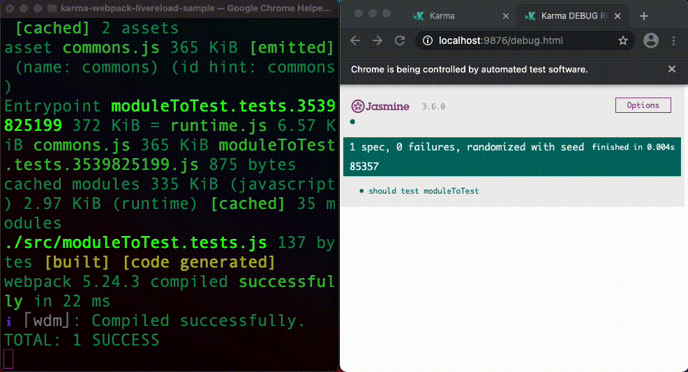

# Karma Webpack Livereload
Livereload extension for `karma-webpack` which is useful for different html reporters like `karma-jasmine-html-reporter`.

## Install
- npm 
  ```shell
  npm i -D karma-webpack karma-webpack-livereload
  ```

- yarn 
  ```shell
  yarn add -D karma-webpack karma-webpack-livereload
  ```

## Usage

Here is the sample karma configuration which uses `jasmine` and `karma-jasmine-html-reporter`
but any other reporters which works in a browser should work.

**karma.conf.js**:
```js
module.exports = (config) => {
  config.set({
    frameworks: ['jasmine', 'webpack'], // webpack framework is required
    
    plugins: [
        "karma-jasmine",
        "karma-jasmine-html-reporter", // add some html reporters
        "karma-webpack",  // karma-webpack plugin is required
        "karma-webpack-livereload" // this is our livereload plugin which is also required
    ],

    files: [
      { pattern: 'test/**/*.test.js', watched: false }
    ],

    preprocessors: {
      // webpack and webpack-livereload are required
      // and should be added in this order
      'test/**/*.test.js': [ 'webpack', 'webpack-livereload' ]
    },

    // add some html reporters
    reporters: ['kjhtml'],

    // karma-webpack-livereload plugin will be automatically disabled 
    // if singleRun == true
    // singleRun: true,
    
    webpackLivereload: {
      // forces our karma-webpack-livereload plugin to be enabled/disabled.
      // could be omitted as plugin is enabled by default
      enabled: true, 
      
      // if this property is passed - karma-webpack-livereload plugin will be enabled
      // only if reporters in karma.conf contains any of reporters mentioned in this property
      reporters: ['kjhtml']
    },
    
    webpack: {
      // webpack configuration
    },
  });
}
```

Since `karma-webpack-livereload` based on `karma-webpack` plugin, please
also read `karma-webpack` plugin [documentation](https://github.com/ryanclark/karma-webpack)

### How it works

This plugin is a `karma` preprocessor which works in conjunction with `karma-webpak` plugin.
It enhances the way how `karma-webpack` utilizes `webpack`: in addition to the standard 
webpack compiler creation, this plugin starts `webpack-dev-server` which has embedded livereload capabilities.

### Sample
`./sample` folder in the source code contains minimal example which demonstrates how this plugin works:

In order to test this sample follow these steps:
- checkout source code: `git clone git@github.com:sprilukin/karma-webpack-livereload.git`
- execute:
  ```shell
  cd karma-webpack-livereload
  yarn install
  cd sample
  yarn install
  yarn run test
  ```
- open the following url in the browser: [http://localhost:9876/]()
- try to edit `karma-webpack-livereload/sample/src/moduleToTest.tests.js` and do simple change:
  ```js
  //expect(moduleToTest(1, 1)).toBe(2);   // <--- original code
  expect(moduleToTest(1, 2)).toBe(2);   // <--- modified code  
  ```
- ensure that the browser page refreshed automatically and shows failed test result:


